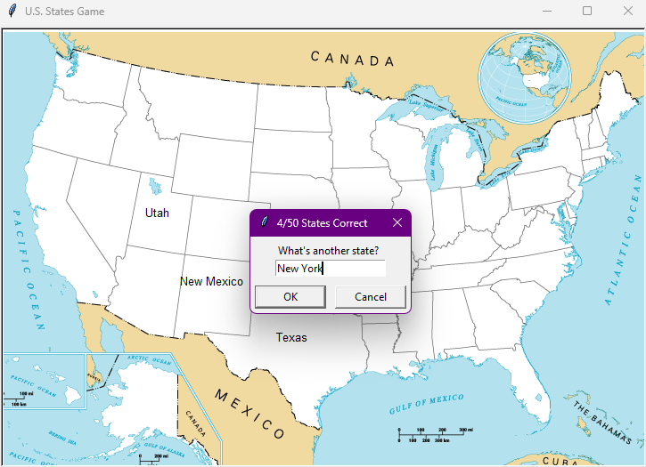

# Turtle Crossing Game
## Overview
Hello, everyone! I'm Mert, and today is Day 23 of my "100 Days of Python" challenge. For this project, I'm excited to introduce the "Turtle Crossing Game," a Python program using the Turtle graphics library. In this game, you'll guide a turtle to cross a busy road while avoiding cars.

## Project Description
In the "Turtle Crossing Game," you control a turtle at the bottom of the screen, trying to cross a busy road with moving cars. Your goal is to safely reach the top of the screen without colliding with any cars. The game becomes progressively challenging as the speed of the cars increases. Be careful and swift to navigate the road successfully!



## How to Run
To play the Turtle Crossing Game, run the following command:

```bash
python main.py
```

Ensure that you have Python installed on your system and that you have the required files in the same directory: "main.py," "state_turtle.py," "50_states.csv," and "blank_states_img.gif."

## Project Files
* main.py: The main Python script for the U.S. States Game.
* state_turtle.py: Contains the State class for displaying and positioning U.S. states.
* 50_states.csv: CSV file containing U.S. states data, including their names, coordinates, etc.
* blank_states_img.gif: Image file representing a blank map of the U.S. states.
## Getting Started
* Run the "main.py" script to start the game.
* Enter the name of a U.S. state when prompted.
* Try to correctly position the state name on the map.
* The game will display your progress with each correct guess.
* To exit the game, type "Exit" when prompted for a state name.
## Educational Insights
This project provides hands-on experience with key Python concepts:

* Turtle Graphics: Utilizing the Turtle graphics library for interactive visual elements.
* File Handling: Reading data from a CSV file to access U.S. states information.
* Object-Oriented Programming: Implementing classes (State) to organize code and manage game entities.
* User Input Handling: Using keyboard input to interact with the game.
* Game Logic: Checking and updating the game state based on user input.
## Conclusion
I hope you enjoy playing the U.S. States Game! It's been an exciting journey reaching Day 25, and I'm eager to continue exploring and learning. Have fun learning and identifying U.S. states, and happy coding!
